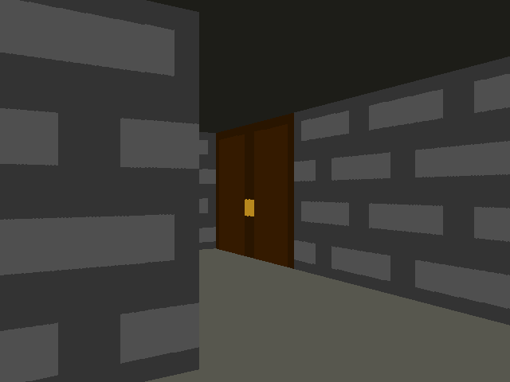

# maze_ray_casting

Navigate a randomly generated raycasted maze

The maze is raycasted using the DDA algorithm ([written after reading this lodev article](https://lodev.org/cgtutor/raycasting.html))



## build instructions (linux)

Requires sdl2 (archlinux `sdl2` and `sdl2_image`)

```
cd maze_ray_casting
make
./main
```
